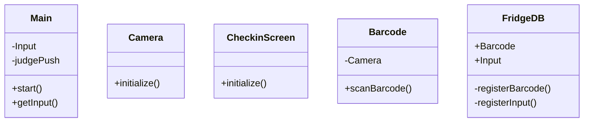

```mermaid
  classDiagram
    class Main {
      +start()
      +getInput()
      -Input
      -judgePush
    }

    class Camera {
      +initialize()
    }

    class CheckinScreen {
        +initialize()
      }
    class Barcode {
        +scanBarcode()
        -Camera
      }

    class FridgeDB {
      +Barcode
      +Input
      -registerBarcode()
      -registerInput()
    }
```
