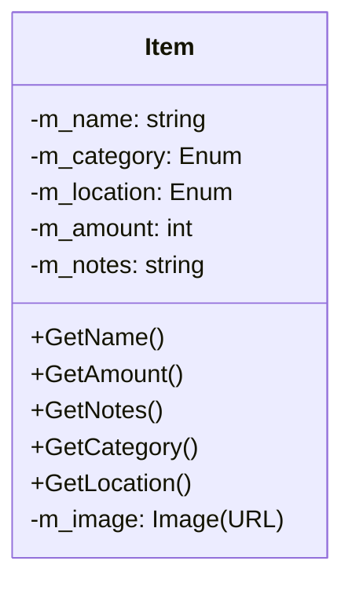

```mermaid
classDiagram
	class Item {
		+GetName()
        +GetAmount()
        +GetNotes()
        +GetCategory()
        +GetLocation()
		-m_name: string
        -m_image: Image(URL)
		-m_category: Enum
        -m_location: Enum
		-m_amount: int
        -m_notes: string
  }
```