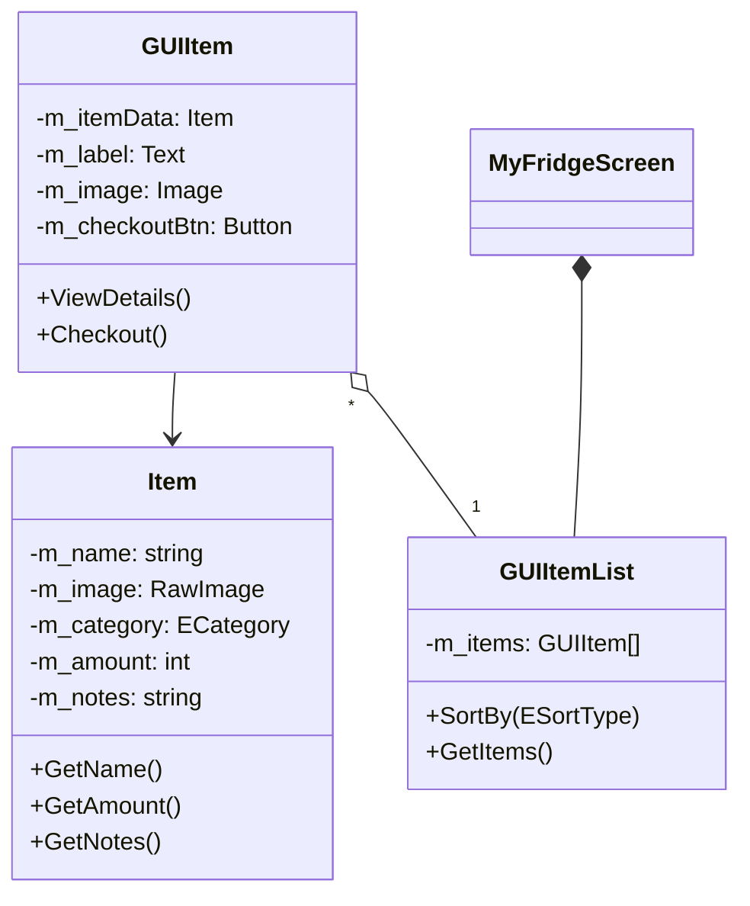

```mermaid
    classDiagram
    	class Item {
    		+GetName()
        +GetAmount()
        +GetNotes()
    		-m_name: string
        -m_image: RawImage
    		-m_category: ECategory
    		-m_amount: int
        -m_notes: string
      }
    
      class GUIItem {
    		+ViewDetails()
        +Checkout()
    		-m_itemData: Item
    		-m_label: Text
        -m_image: Image
        -m_checkoutBtn: Button
      }
    
      class GUIItemList {
        +SortBy(ESortType)
        +GetItems()
    		-m_items: GUIItem[]
      }
    
      class MyFridgeScreen {
      }
    
      MyFridgeScreen *-- GUIItemList
      GUIItem --> Item
      GUIItem "*" o-- "1" GUIItemList
```