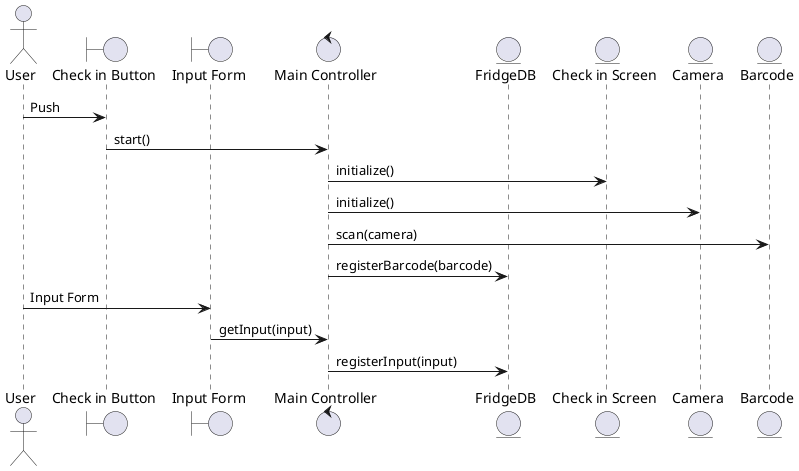

```plantuml

@startuml

actor User
boundary "Check in Button" as checkinbutton
boundary "Input Form" as inputform
control "Main Controller" as maincontroller
entity "FridgeDB" as fridgedb
entity "Check in Screen" as checkinscreen
entity "Camera" as camera
entity "Barcode" as barcode


User -> checkinbutton: Push
checkinbutton -> maincontroller: start()
maincontroller -> checkinscreen: initialize()
maincontroller -> camera: initialize()
maincontroller -> barcode: scan(camera)
maincontroller -> fridgedb: registerBarcode(barcode)
User -> inputform: Input Form
inputform -> maincontroller: getInput(input)
maincontroller -> fridgedb: registerInput(input)


@enduml

```
