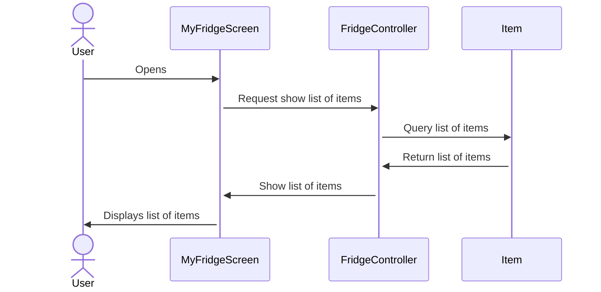
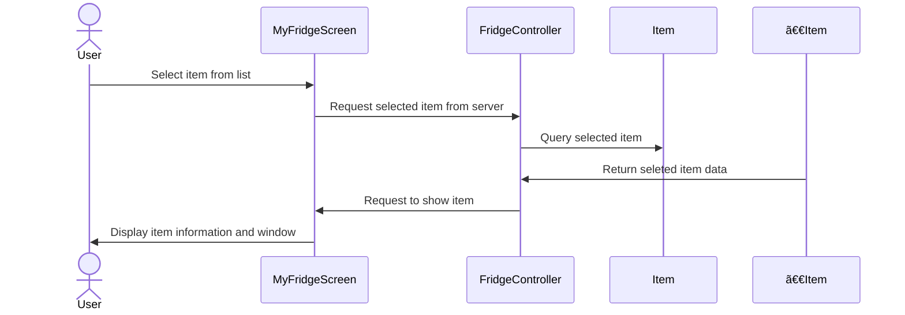

```mermaid
    sequenceDiagram
    	actor User
      User->>MyFridgeScreen: Opens
      activate MyFridgeScreen
      MyFridgeScreen->>FridgeController: Request show list of items  
      activate FridgeController
      FridgeController->>Item: Query list of items
      activate Item
      Item->>FridgeController: Return list of items
      FridgeController->>MyFridgeScreen: Show list of items
      MyFridgeScreen->>User: Displays list of items
```

```mermaid
    sequenceDiagram
      actor User
    	User->>MyFridgeScreen:Select item from list
    	MyFridgeScreen->>FridgeController: Request selected item from server
      FridgeController->>Item: Query selected item
    　Item->>FridgeController: Return seleted item data
      FridgeController->>MyFridgeScreen: Request to show item
      MyFridgeScreen->>User: Display item information and window
```
